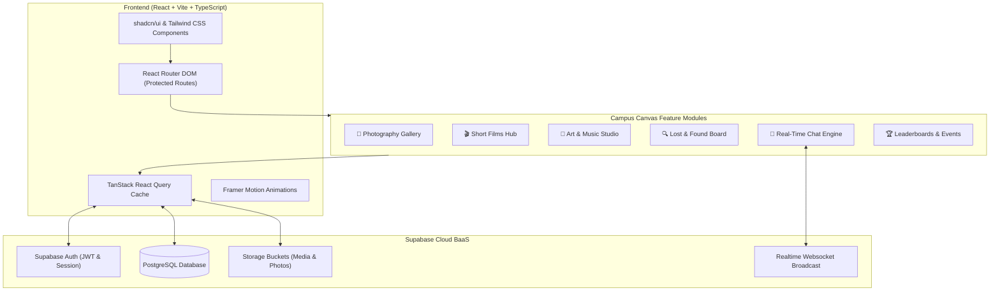

# 🎨 Campus Canvas

> **The Ultimate Student-Driven Creative Showcase & Campus Community Hub**

[](https://campus-canvas-rose.vercel.app)
[](https://react.dev/)
[](https://www.typescriptlang.org/)
[](https://vitejs.dev/)
[](https://tailwindcss.com/)
[](https://supabase.com/)

**Campus Canvas** is a modern, interactive web platform created for university and college students to showcase their creative talents, connect across departments, recover lost belongings, and engage in real-time campus conversations.

🌐 **Live Deployment**: [https://campus-canvas-rose.vercel.app](https://campus-canvas-rose.vercel.app)

---

## 📌 Table of Contents
- [Core Features](#-core-features)
- [System Architecture](#-system-architecture)
- [Technology Stack](#-technology-stack)
- [Project Structure](#-project-structure)
- [Getting Started](#-getting-started)
  - [Prerequisites](#prerequisites)
  - [Installation](#installation)
  - [Environment Variables](#environment-variables)
  - [Running the App](#running-the-app)
  - [Running Tests](#running-tests)
- [Database & Supabase Integration](#-database--supabase-integration)
- [Deployment](#-deployment)
- [Author & Credits](#-author--credits)

---

## 🚀 Core Features

### 📸 1. Photography Showcase
* High-resolution photo gallery for student photographers.
* Filter and browse creative submissions by academic department (Engineering, Arts, Design, Business, etc.).
* Like, interact, and discover trending campus captures.

### 🎬 2. Student Films & Cinema
* Dedicated screening room for student-directed short films, reels, and video projects.
* Streaming-optimized layout for cinematic showcases, student bios, and project credits.

### 🎨 3. Art & Music Hub
* Digital illustrations, traditional sketches, concept art, and canvas paintings.
* Audio player integration for campus musicians, bands, and podcast creators to publish original compositions.

### 🔍 4. Campus Lost & Found
* Community-driven lost-and-found board to quickly reunite items with their owners.
* Submit lost/found reports with item photos, location tags, date/time, and contact channels.
* Mark items as resolved once claimed.

### 💬 5. Real-Time Campus Chat
* Instant live chat powered by **Supabase Realtime WebSockets**.
* Discuss campus events, collaborate on inter-departmental projects, and exchange ideas without leaving the app.

### 🏆 6. Department Leaderboards & Campus Events
* **Department Gamification**: Live scoreboard ranking college departments by creative upvotes and engagement.
* **Events & RSVP Tracker**: Keep track of upcoming campus hackathons, open mic nights, tech talks, and art exhibitions with local RSVP bookmarking.

### 🔐 7. Secure Authentication & Protected Routes
* Student registration and login powered by Supabase Auth.
* Route guards preventing unauthenticated access to interactive community modules.

---

## 🏗️ System Architecture



---

## 💻 Technology Stack

| Layer | Technologies |
| :--- | :--- |
| **Framework** | [React 18](https://react.dev/) + [Vite 5](https://vitejs.dev/) |
| **Language** | [TypeScript](https://www.typescriptlang.org/) (Strict Mode) |
| **Styling** | [Tailwind CSS](https://tailwindcss.com/), `tailwind-merge`, `clsx`, `tailwindcss-animate` |
| **UI Components** | [shadcn/ui](https://ui.shadcn.com/) built on [Radix UI primitives](https://www.radix-ui.com/) |
| **Motion & Icons** | [Framer Motion](https://www.framer.com/motion/), [Lucide React](https://lucide.dev/) |
| **Data Fetching** | [TanStack React Query v5](https://tanstack.com/query/latest) |
| **Routing** | [React Router DOM v6](https://reactrouter.com/) |
| **Form Handling** | [React Hook Form](https://react-hook-form.com/) + [Zod Validation](https://zod.dev/) |
| **Backend & Auth** | [Supabase](https://supabase.com/) (PostgreSQL, Row-Level Security, Realtime) |
| **Testing** | [Vitest](https://vitest.dev/), React Testing Library, jsdom |
| **Deployment** | [Vercel](https://vercel.com/) |

---

## 📂 Project Structure

```plaintext
campus-canvas/
│
├── public/                    # Static public assets, favicon, logos
├── src/
│   ├── assets/                # App images, backgrounds, illustrations
│   ├── components/            # Reusable UI component library
│   │   ├── layout/            # Navbar, Footer, and responsive wrappers
│   │   ├── ui/                # 30+ Radix UI / shadcn components (Dialog, Tabs, Toaster, etc.)
│   │   └── ProtectedRoute.tsx # Auth protection wrapper for pages
│   ├── contexts/              # React Context providers (AuthContext, Theme)
│   ├── hooks/                 # Custom reusable React hooks
│   ├── integrations/
│   │   └── supabase/          # Supabase client configuration & types
│   ├── lib/                   # Utility functions (`cn`, date formatters, helpers)
│   ├── pages/                 # Top-level application views
│   │   ├── Index.tsx          # Homepage, leaderboard, features hero, and event feeds
│   │   ├── Photography.tsx    # Campus photo gallery & submission
│   │   ├── Films.tsx          # Short film screening & submission portal
│   │   ├── ArtMusic.tsx       # Creative art & original audio showcase
│   │   ├── LostFound.tsx      # Community lost-and-found board
│   │   ├── Chat.tsx           # Real-time multi-user campus chat
│   │   ├── Login.tsx          # User sign-in
│   │   ├── Register.tsx       # New student registration
│   │   └── NotFound.tsx       # 404 error page
│   ├── test/                  # Test suites and test setup
│   ├── App.tsx                # Main Router configuration and Providers
│   ├── index.css              # Global styles and Tailwind directives
│   └── main.tsx               # DOM mount entry point
│
├── supabase/                  # Supabase schema definitions and migrations
├── .env                       # Local environment variables
├── package.json               # Node dependencies and scripts
├── tailwind.config.ts         # Tailwind design tokens and animations
├── tsconfig.json              # TypeScript compilation config
├── vercel.json                # Vercel deployment routes and headers
├── vite.config.ts             # Vite build configuration
└── vitest.config.ts           # Vitest unit test configuration
```

---

## ⚡ Getting Started

### Prerequisites
* [Node.js](https://nodejs.org/) (version 18.x or 20.x recommended)
* `npm` or `bun` package manager
* A [Supabase](https://supabase.com/) project (free tier works great)

### Installation

1. **Clone the repository:**
   ```bash
   git clone https://github.com/euginjoy007/campus-canvas.git
   cd campus-canvas
   ```

2. **Install project dependencies:**
   ```bash
   npm install
   ```

---

### Environment Variables

Create a `.env` file in the root of the project with your Supabase credentials:

```env
VITE_SUPABASE_URL=https://your-project-id.supabase.co
VITE_SUPABASE_ANON_KEY=your-anon-public-key
```

---

### Running the App

Start the local Vite development server with Hot Module Replacement (HMR):

```bash
npm run dev
```

Open your browser at `http://localhost:5173` to explore the app.

---

### Running Tests

Execute the automated test suite powered by Vitest:

```bash
npm run test
```

Or run tests in watch mode:
```bash
npm run test:watch
```

---

## 🗄️ Database & Supabase Integration

The app communicates with Supabase PostgreSQL tables:
* `profiles`: User information, department affiliation, and avatar.
* `photos`: Photography submissions with department tags, image URLs, and likes.
* `films`: Student short film entries and video URLs.
* `art_music`: Creative uploads, artwork image paths, and audio file tracks.
* `lost_found`: Items flagged as lost or found with contact details and status flags.
* `messages`: Real-time chat messages broadcast via Supabase Realtime channels.

---

## 🚀 Deployment

The project is configured for one-click deployment on **Vercel**:

1. Push your changes to GitHub.
2. Import the repository into your [Vercel Dashboard](https://vercel.com/).
3. Add the `VITE_SUPABASE_URL` and `VITE_SUPABASE_ANON_KEY` environment variables in Vercel project settings.
4. Deploy! Single-Page Application (SPA) routing is handled automatically via `vercel.json`.

---

## 👤 Author & Credits

* **Author:** [Eugin Joy](https://github.com/euginjoy007)
* **GitHub:** [@euginjoy007](https://github.com/euginjoy007)
* **Live Site:** [https://campus-canvas-rose.vercel.app](https://campus-canvas-rose.vercel.app)
* **Repository:** [campus-canvas](https://github.com/euginjoy007/campus-canvas)
